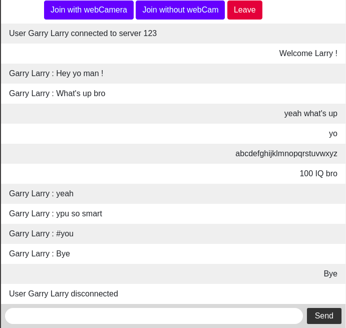

# Realtime Chat & Phone App with Node.js :telephone_receiver:

## Demo :speaker:

## Using

### Socket.io :bulb:

> connect users' messages in realtime.

### Peer.js :phone:

> P2P data transfer to make phone call between users.

### Bootstrap :notes:

> Frontend css framework.

### Express.js & Ejs :+1:

> express as backend framework, ejs as render type.

## What I learned from this project :heart:

1. How socket.io works and how to design realtime app with it. :sunglasses:

2. Usage of Peer.js, how to stream video with it. :muscle:

3. What is event emitter in Node.js and Node.js v8 engine knowledge(Event-driven, Single thread, async IO ... ). :blush:

## How to install :monkey:

Install modules

"""
npm install
"""

Add environment variable if you deploy on server (take Heroku as example)

"""
PEER_HOST=yourapp.heroku.com
PEER_PATH=uptoyou
PEER_PORT=443
"""

[Stackoverflow here if you have any question.](https://stackoverflow.com/questions/48084622/deploy-peerjs-server-on-heroku)

## Run Server :rabbit:

Now you can run the server and see it on localhost:3000

"""
npm start
"""

